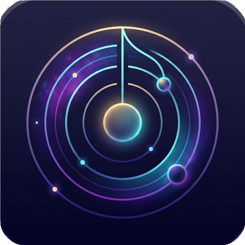

<div align="center">
  
  <h1>Musica Universalis</h1>
  <p><i>The Harmony of the Spheres. A Premium Local & Connected Desktop Music Player.</i></p>
</div>

---

## 🎵 Overview

**Musica Universalis** (formerly Phonation Music Player) is a beautifully crafted, feature-rich desktop music application built with Electron. Designed for audio enthusiasts, it seamlessy bridges the gap between your local, high-fidelity audio library and modern streaming services, all while integrating flawlessly with the Sonos ecosystem.

With a focus on stunning aesthetics, dynamic performance, and deep device integration, Musica Universalis transforms how you experience your music on the desktop.

## ✨ Key Features

- **High-Fidelity Local Playback:** Effortlessly scan, organize, and play your local `.mp3` and `.flac` libraries with full ID3 metadata support, embedded album art extraction, and gapless playback.
- **Deep Sonos Integration:** Not just a local player. Dynamically discover and connect to Sonos speakers on your local network. Cast your local library directly to your premium hardware with live playback sync and volume control.
- **YouTube Music Profiles:** Break out of the browser. Create sandboxed profiles to stream YouTube Music directly within the app, complete with audio interception to cast streamed content directly to your Sonos devices.
- **Premium Aesthetics:** Choose between three meticulously designed themes (Dark, Light, and Volcanic), featuring glassmorphism, dynamic color extraction, smooth micro-animations, and responsive layouts.
- **Advanced Queue Management:** Build custom playlists, manage a dynamic "Now Playing" slide-out queue, and enjoy intuitive context menus for unparalleled control over your listening session.
- **In-App Image Viewer:** Click on embedded artwork to view high-resolution imagery in a beautiful interactive overlay.

## 🛠️ Technology Stack

Built on web technologies tailored for desktop performance:

- **Framework:** Electron & Node.js
- **Frontend:** Vanilla HTML, CSS, JavaScript (Zero-framework for maximum responsiveness)
- **Audio Routing:** Native Web Audio API & MediaStreamDestination bridging
- **Key Libraries:**
  - `@svrooij/sonos` - Sonos device discovery and control bridging.
  - `express` & `ws` - Local webserver and websocket bridge for cross-device casting.
  - `fluent-ffmpeg` & `ffmpeg-static` - On-the-fly audio stream manipulation and transcoding.
  - `music-metadata` - Deep local audio file parsing.

## 🚀 Installation

### Using the Pre-compiled Installer (Windows)

1. Navigate to the [Releases](https://github.com/TheCanisDirus/MusicaUniversalis/releases) page.
2. Download the latest `Musica Universalis Setup [version].exe`.
3. Run the installer and launch the application.

### Building from Source

To run Musica Universalis locally in a development environment:

1. **Clone the repository:**
   ```bash
   git clone https://github.com/TheCanisDirus/MusicaUniversalis.git
   cd MusicaUniversalis
   ```

2. **Install dependencies:**
   ```bash
   npm install
   ```

3. **Start the application:**
   ```bash
   npm start
   ```

4. **Build the executable:**
   ```bash
   npm run build
   ```
   *(Note: This uses `electron-builder` to generate a Windows installer in the `/dist` directory).*

## 🎨 Themes

Musica Universalis includes three core themes accessible from the Settings panel:

- **Dark Mode (Default):** Deep, focused, and easy on the eyes.
- **Light Mode:** High contrast, crisp, and clean.
- **Volcanic:** A striking, fiery gradient experience for when you want your player to stand out.

---

<div align="center">
  <p><i>"There is geometry in the humming of the strings, there is music in the spacing of the spheres." — Pythagoras</i></p>
</div>
